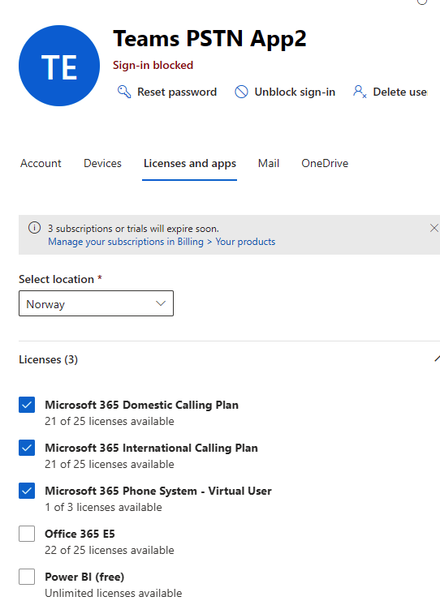

# PSTN Call issue (http Post request)
I'm trying to make a bot call a PSTN number. using this example: [Create peer-to-peer PSTN call with application hosted media](https://docs.microsoft.com/en-us/graph/api/application-post-calls?view=graph-rest-beta&tabs=http#example-10-create-peer-to-peer-pstn-call-with-application-hosted-media) from the [Cloud communications part of the MS Graph API](https://docs.microsoft.com/en-us/graph/api/resources/communications-api-overview?view=graph-rest-beta)

But the request yields a: **Call source identity invalid.**
``` json
{
    "error": {
        "code": "7507",
        "message": "Call source identity invalid.",
        "innerError": {
            "date": "2021-02-12T13:10:07",
            "request-id": "2032222f-84b9-4906-bb37-ec938d29ec45",
            "client-request-id": "2032222f-84b9-4906-bb37-ec938d29ec45"
        }
    }
}
```

# What works
It's not like nothing works. I have a functioning bot that can call a user and listen to make a 10 second voice recording ([using MS Graph github sample](https://github.com/microsoftgraph/microsoft-graph-comms-samples/tree/master/Samples/V1.0Samples/StatelessSamples/VoiceRecorderAndPlaybackBot#introduction)).

I can then use a client like postman to make a post request, using this example: [Create peer-to-peer VoIP call with service hosted media](https://docs.microsoft.com/en-us/graph/api/application-post-calls?view=graph-rest-beta&tabs=http#example-1-create-peer-to-peer-voip-call-with-service-hosted-media), to initiate the call.

# What I try to make example 9 (and/or) 10 work:
## Getting Client ID and Secret from Azure AD App Registration
1. With application ID and Secret I get a token using
https://login.microsoftonline.com/{{TenantID}}/oauth2/v2.0/token
2. The token has the following roles:
    ``` json
    "roles": [
    "Calls.JoinGroupCall.All",
    "Calls.InitiateGroupCall.All",
    "Calls.JoinGroupCallAsGuest.All",
    "CallRecords.Read.All",
    "CallRecord-PstnCalls.Read.All",
    "Calls.AccessMedia.All",
    "Calls.Initiate.All"],
    ```

## Creating an application instance, and assigning license and phonenumber
1. Using Powershell commandlets to register and edit settings:
    
    ```powershell
    New-CsOnlineApplicationInstance -UserPrincipalName teams-pstn-app2@acme.onmicrosoft.com -ApplicationId ce933385-9390-45d1-9512-c8d228074e07 -DisplayName "Teams PSTN App2"

    # Application ID types being:
    #Auto Attendant: ce933385-9390-45d1-9512-c8d228074e07 Call Queue: 11cd3e2e-fccb-42ad-ad00-878b93575e07
    
    #Return answer: 
    RunspaceId        : xxxxxxxx-xxxx-xxxx-xxxx-xxxxxxxx
    #The object ID is the ID of the Application User.
    ObjectId          : 5cxxxxxx-xxxx-xxxx-xxxx-xxxxxxe4
    TenantId          : 18xxxxxx-xxxx-xxxx-xxxx-xxxxxxce
    UserPrincipalName : teams-pstn-app2@acme.onmicrosoft.com
    ApplicationId     : ce933385-9390-45d1-9512-c8d228074e07
    DisplayName       : Teams PSTN App2
    PhoneNumber       : 

    #Runnin the syncobject command:
    Sync-CsOnlineApplicationInstance -ObjectId 5cxxxxxx-xxxx-xxxx-xxxx-xxxxxxe4

    ```

2. Assigning the following licenses to the user :
    * Microsoft 365 Domestic Calling Plan
    * Microsoft 365 International Calling Plan
    * Microsoft 365 Phone System - Virtual User.

        

3. I have tried a few different types of service phone numbers:
   
    

4. Also tried with different numbers assigned:
      ```powershell
    Set-CsOnlineVoiceApplicationInstance -Identity teams-pstn-app2@amestoid.onmicrosoft.com -TelephoneNumber +47xxxxxx61
    Sync-CsOnlineApplicationInstance -ObjectId 5c1e2e0f-95e9-4cb6-a8d6-938fdb0f32e4

    ```

## Running POST Request from Postman:

```json
{
  "@odata.type": "#microsoft.graph.call",
  "callbackUri": "https://3bxxXXxxXX24.eu.ngrok.io/callback",
  "source": {
    "@odata.type": "#microsoft.graph.participantInfo",
    "identity": {
      "@odata.type": "#microsoft.graph.identitySet",
      "applicationInstance": {
        "@odata.type": "#microsoft.graph.identity",
        "displayName": "Teams PSTN App2",      
        "id": "5cxxxxxx-xxxx-xxxx-xxxx-xxxxxxxxxe4" 
        /*THE OBJECT ID OF APPLICATION USER (also tried the ID of the app registration)*/
      }
    },
    "countryCode": null,
    "endpointType": null,
    "region": null,
    "languageId": null
  },
  "targets": [
    {
      "@odata.type": "#microsoft.graph.invitationParticipantInfo",
      "identity": {
        "@odata.type": "#microsoft.graph.identitySet",
        "phone": {
          "@odata.type": "#microsoft.graph.identity",
          "id": "+4512345678"
        }
      }
    }
  ],
  "requestedModalities": [
    "audio"
  ],
  "mediaConfig": {
    "@odata.type": "#microsoft.graph.appHostedMediaConfig",
    "blob": "<Media Session Configuration>"
  }
}
```

## In every permutation I try I get the following error:
**Call source identity invalid.**
``` json
{
    "error": {
        "code": "7507",
        "message": "Call source identity invalid.",
        "innerError": {
            "date": "2021-02-12T13:10:07",
            "request-id": "2032222f-84b9-4906-bb37-ec938d29ec45",
            "client-request-id": "2032222f-84b9-4906-bb37-ec938d29ec45"
        }
    }
}
```


